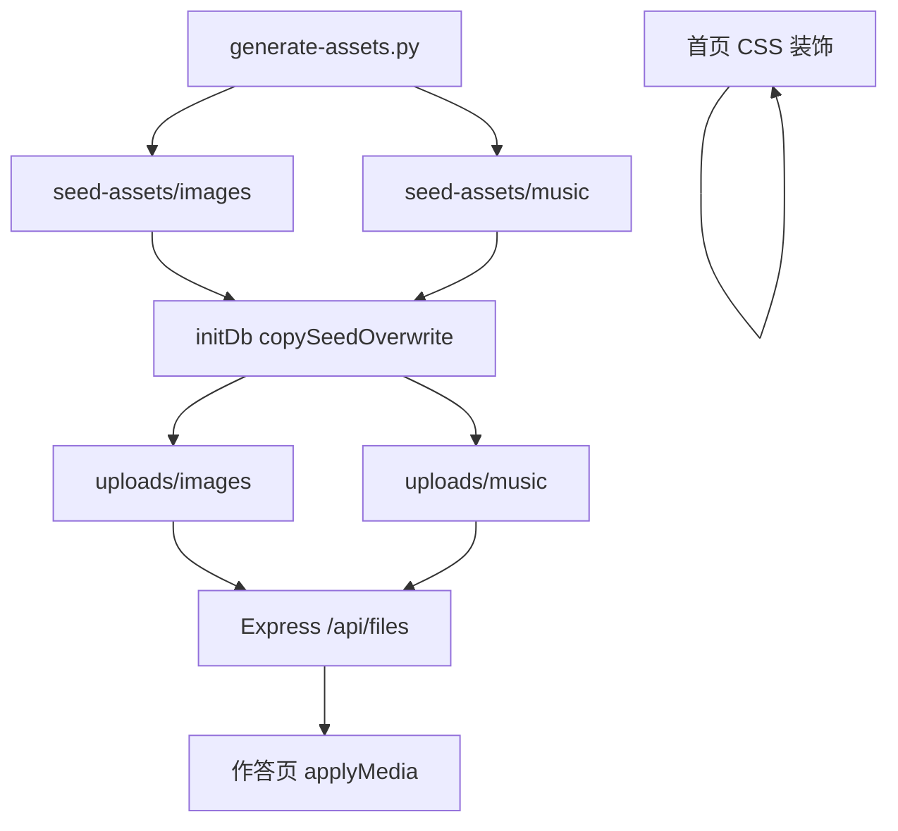
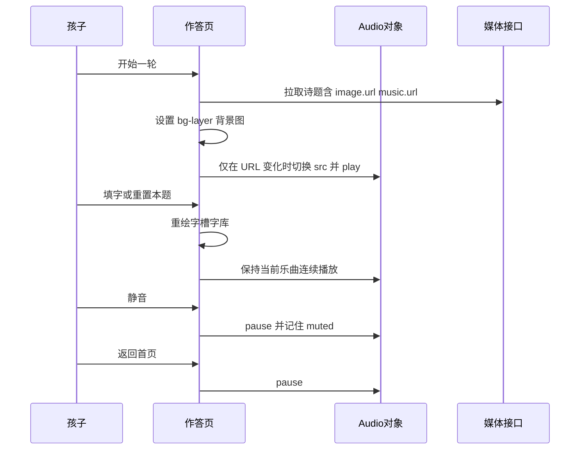

# 精致童趣氛围背景与典雅背景乐

Feature Name: refined-atmosphere
Updated: 2026-09-30

## Description

升级古诗词填写小游戏的氛围层：用可复现的脚本生成更精致、更贴合诗意、更能吸引儿童的循环背景动画，以及旋律加伴奏的五声古风循环乐曲；首页同步加上古风童趣装饰。诗题与媒体仍通过现有 `imageId` / `musicId` 绑定。种子文件名保持不变，启动时用最新种子覆盖同名文件，已有题库立即看到新画面、听到新乐曲。自定义上传与题库管理接口保持现有行为。

已确认的设计决策：

- 资源生成方式：升级 `scripts/generate-assets.py`，仓库内可复现、无外部版权依赖
- 改造范围：作答页诗题媒体 + 首页装饰；首页保持静音
- 已有题库：同名覆盖种子文件，绑定关系不变

## Architecture

氛围层分三条路径，互不改动题库 API 契约：

1. 构建期生成：Python 脚本写出 `seed-assets/images/*.gif` 与 `seed-assets/music/*.wav`
2. 启动期分发：`server/db.js` 把已知种子文件名覆盖拷贝到 `uploads/`，空库时仍插入绑定记录
3. 运行期呈现：作答页 `.bg-layer` 铺图 + `Audio` 循环播乐；首页用 CSS 分层装饰





## Components and Interfaces

### 1. 种子资源生成器 `scripts/generate-assets.py`

职责：一次性（或按需）生成全部默认 GIF 与 WAV，覆盖写入 `seed-assets/`。

画面生成约定：

| 文件 | 诗题 / 用途 | 必含意象 | 动态重点 |
| --- | --- | --- | --- |
| `jingyesi.gif` | 静夜思 | 夜空、明月、窗棂、星点、远山剪影 | 月辉呼吸、星闪、窗帘或窗格轻微明灭 |
| `chunxiao.gif` | 春晓 | 晨光、花卉、飞鸟、草地、朝霞 | 花瓣轻颤、鸟群飞过、光斑漂移 |
| `yonge.gif` | 咏鹅 | 池水、白鹅、波纹、荷叶、岸柳 | 鹅游动、水波、荷叶摇 |
| `minnong.gif` | 悯农 | 田野、禾苗、日头、田埂、远山 | 麦浪、日头光晕、蜻蜓或蝴蝶飞过 |
| `dengguanquelou.gif` | 登鹳雀楼 | 夕阳、山峦、河流、楼阁、归鸟 | 日落位移、河面反光、楼灯微亮 |
| `default.gif` | 未绑定图片 | 宣纸底、云纹、水墨远山 | 云缓慢横移、墨晕呼吸 |

画面技术指标：

- 画布：1280×720
- 帧数：24 帧
- 单帧时长：120 ms（总循环约 2.88 s）
- 无限循环 `loop=0`
- 分层绘制：天空渐变、远景、中景、近景、高光粒子；每帧可区分主色不少于 8 种
- 角色与动物：圆形头部、短肢、无尖齿尖爪；禁止惊吓造型
- 调色板：儿童向高饱和，同时与宣纸 UI（`--paper` / `--ink`）兼容，避免荧光色

实现要点：

- 用 `PIL.Image` + `ImageDraw` 分层合成，先画天空与地面，再画景物，最后画高光
- 用缓动正弦（`sin(t * tau)`）驱动位移与透明度，避免线性跳动
- 对圆形、椭圆、圆角多边形做角色；植物用重复茎叶单元加随机相位
- GIF 保存前量化到 128 色并 `optimize=True`，单文件目标控制在 400 KB 以内，避免首屏过慢

乐曲生成约定：

| 文件 | 调式倾向 | 听感 |
| --- | --- | --- |
| `jingyesi.wav` | 羽调（偏静） | 夜曲，慢板，空灵感 |
| `chunxiao.wav` | 商调（偏明） | 晨曲，轻快但不急 |
| `yonge.wav` | 角调（偏嬉） | 水嬉，跳跃音型 |
| `minnong.wav` | 宫调（偏稳） | 田园，平稳循环 |
| `dengguanquelou.wav` | 徵调（偏开） | 登高，稍开阔 |
| `default.wav` | 宫羽混合 | 中性古曲，适合任意诗 |

乐曲技术指标：

- 采样率 44100 Hz，16-bit PCM，立体声（左旋律、右伴奏略微错开，形成宽度）
- 时长不少于 16 秒；首尾 0.4 秒交叉淡入淡出，循环时听感连续
- 声部：主旋律（五声）+ 五度/八度垫音或分解和弦伴奏；可加极弱高频泛音模拟琴弦
- 包络：每个音 15–30 ms 起音、自然衰减；禁止方波与硬切
- 合成峰值 `|sample| <= 0.85`，响度听感接近当前前端 `audio.volume = 0.35`
- 默认播放音量仍由前端 `Audio.volume` 控制在 0.28–0.42

`write_wav` 升级为多声部合成：按拍写入旋律序列，同步叠加低八度持续音与弱琶音；循环边界把最后半拍与第一半拍做线性交叉。

### 2. 启动期分发 `server/db.js`

新增已知种子文件清单，启动时覆盖拷贝：

```javascript
const SEED_IMAGE_FILES = [
  "default.gif",
  "jingyesi.gif",
  "chunxiao.gif",
  "yonge.gif",
  "minnong.gif",
  "dengguanquelou.gif",
];
const SEED_MUSIC_FILES = [
  "default.wav",
  "jingyesi.wav",
  "chunxiao.wav",
  "yonge.wav",
  "minnong.wav",
  "dengguanquelou.wav",
];
```

`copySeedFile(srcDir, destDir, filename)` 改为始终用源文件覆盖目标文件。自定义上传使用 `Date.now()-hex.ext` 文件名，与种子文件名不相交，覆盖不会碰到用户上传文件。

`seedIfEmpty` 仍只在诗表为空时插入记录；已有库只更新磁盘文件，数据库绑定保持原 `image_id` / `music_id`。

媒体 MIME、上传大小限制、删除保护逻辑保持不变。

### 3. 作答页呈现 `web/src/main.js` + `web/src/styles.css`

`applyMedia(poem)` 职责拆成“换图”和“换曲”：

- 背景图：每次进入作答页或切题时设置 `.bg-layer` 的 `background-image`
- 背景乐：仅当目标 URL 与 `audio.src` 不同时才赋值 `src`；静音状态只 `pause` / `play`，填字与重置本题不再触发换源
- 默认回退：`/api/files/images/default.gif`、`/api/files/music/default.wav`

可读性：

- 保留 `.bg-layer::after` 纵向暗角遮罩
- 字槽区、字库、按钮继续落在 `--paper-deep` 底板上
- 标题与静音按钮保留浅色字 + 投影；若新 GIF 偏亮，把遮罩上沿透明度调整到约 `0.22–0.50`，保证标题可读

切题时允许换曲；同一首诗内的交互保持当前播放位置。

### 4. 首页装饰 `web/src/styles.css`

`.home` 在现有渐变之上叠加至少两类 CSS 装饰：

- 云纹：半透明径向渐变斑块，缓慢水平位移动画
- 灯笼或花枝：伪元素圆角色块 / 重复径向点，置于品牌标题两侧

首页不创建、不播放 `Audio`。题库管理页保持现有纸面样式，避免干扰编辑。

### 5. 接口契约（无破坏性变更）

| 接口 | 行为 |
| --- | --- |
| `GET /api/round` | 返回诗题，含 `image.url` / `music.url` |
| `GET /api/files/images/:name` | 提供覆盖后的新 GIF |
| `GET /api/files/music/:name` | 提供覆盖后的新 WAV |
| `POST /api/images` `POST /api/music` | 自定义上传，文件名仍唯一化 |

前端消费字段不变：`poem.image.url`、`poem.music.url`。

## Data Models

媒体与诗题表结构保持现有 SQLite 模式：

- `images(id, name, filename, mime_type, created_at)`
- `music(id, name, filename, mime_type, created_at)`
- `poems(id, title, author, body, image_id, music_id, created_at, updated_at)`

种子文件名是氛围层的稳定主键。升级资源只替换磁盘字节，不改 `id` 与绑定。

生成器内部结构（脚本内存模型，不入库）：

```text
SceneFrame = { t: 0..1, layers: [sky, far, mid, near, spark] }
VoiceNote  = { freqHz, startSec, durationSec, gain, waveform }
Score      = { sampleRate: 44100, voices: [melody, pad, arp], lengthSec >= 16 }
```

## Correctness Properties

1. 五首内置诗与默认媒体的文件名在升级前后一致。
2. 每张种子 GIF 满足：宽>=1280、高>=720、帧数>=24、loop 无限、单帧 80–160 ms。
3. 每首种子 WAV 满足：44100 Hz、时长>=16 s、双声部、峰值不削波。
4. 作答页未绑定时回退到 `default.gif` / `default.wav`。
5. 同一诗题内的填字、换字、重置不导致乐曲从头播放。
6. `muted === true` 时音频处于暂停；返回首页后音频处于暂停。
7. 覆盖拷贝只作用于种子文件名清单；用户上传文件名保持独立。
8. 首页装饰存在且首页不自动播乐。

## Error Handling

| 场景 | 处理 |
| --- | --- |
| 种子源文件缺失 | `copySeedFile` 抛出明确错误，阻止服务带残缺默认资源启动 |
| GIF / WAV 生成失败 | 脚本以非零状态退出，保留上一次成功产物 |
| 浏览器拒绝自动播放 | `audio.play().catch(() => {})`，静音按钮仍可手动打开 |
| 某诗媒体 404 | `applyMedia` 回退默认图与默认曲 |
| 用户上传与种子同名 | 实际上传路径使用唯一化文件名，不会覆盖种子 |
| 新 GIF 体积过大导致首屏慢 | 生成阶段量化与压缩；前端继续用 CSS `cover`，不额外阻塞字槽渲染 |

## Test Strategy

### 资源产物检查

- 新增脚本或测试读取 `seed-assets/images/*.gif`：校验尺寸、帧数、duration、loop
- 读取 `seed-assets/music/*.wav`：校验采样率、声道、时长、峰值 `< 1.0`
- 人工目视清单：六张图各自命中 Requirement 2 的意象；角色圆润友善

### 后端

- 在临时目录调用覆盖拷贝：目标已存在时内容变为新种子字节
- 空库种子后，五首诗的 `image.filename` / `music.filename` 仍为约定文件名
- 自定义上传后文件名匹配 `^\d+-[0-9a-f]+\.(png|jpe?g|gif|webp|apng|mp3|wav|ogg)$`

### 前端

- `applyMedia`：相同 URL 不改 `audio.src`；切诗才改
- 静音开关：`muted` 为真时 `pause`，为假时 `play`
- 返回首页调用 `audio.pause`
- 视觉回归：作答页标题、字槽在亮背景与暗背景下均可读（抽《春晓》《静夜思》两首）

### 手工验收

1. 清空或不清空数据库均启动，作答页五首诗画面与音乐均已更新
2. 首页可见云纹与灯笼或花枝，无音乐
3. 填字过程中音乐连续
4. 题库上传一张自定义图并绑定，作答页使用自定义图，其他诗仍用新种子

## References

[^1]: (Filename) - 当前资源生成脚本 `scripts/generate-assets.py`
[^2]: (Filename) - 启动期种子拷贝与空库绑定 `server/db.js`
[^3]: (Filename) - 作答页媒体应用 `web/src/main.js`
[^4]: (Filename) - 背景层与首页样式 `web/src/styles.css`
[^5]: (Filename) - 需求文档 `.monkeycode/specs/2026-09-30-refined-atmosphere/requirements.md`
